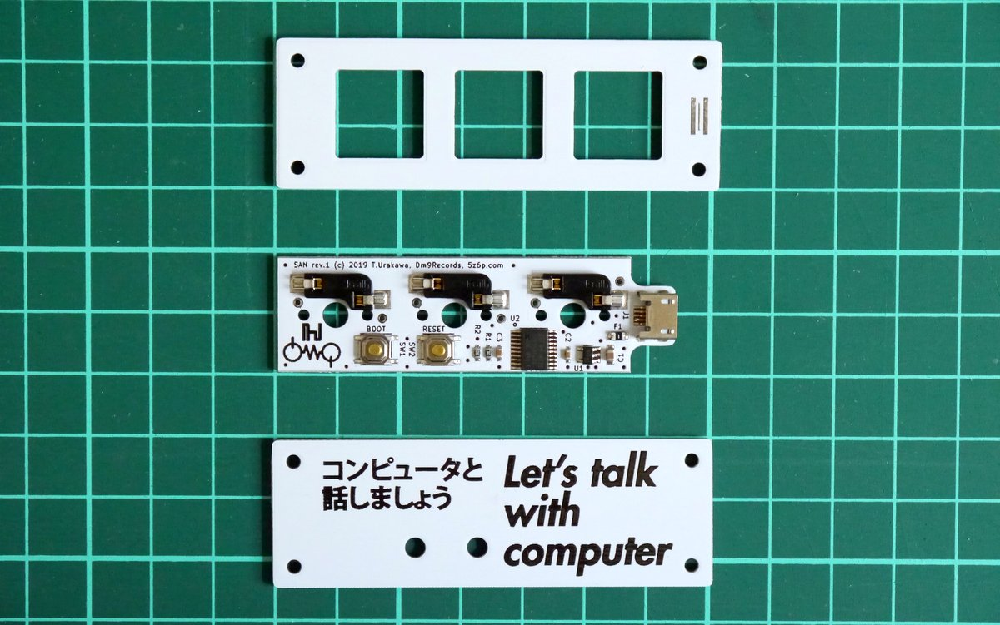

SAN 
=======================================



3keys macro pad.
- STM32F042F6P6
- kailh hotswap socket (MX compatible switch)
- on-chip usb-DFU bootloader
- QMK Firmware(https://github.com/hsgw/qmk_firmware/tree/san)

## Issues
### Rev.1
- 基板上の`BOOT`と`RESET`のシルクが逆になっている
(正しくは`SW1 RESET`, `SW2 BOOT`)

## ビルドガイド
1. 組立てる前にPCと接続してキーボードとして認識されるか、動作を確認する
(ファームウェアが書かれていない場合はブートローダモードで接続されます)
2. ブートローダへ入ってQMK Firmwareからの書き込みを確認する
https://github.com/hsgw/qmk_firmware/san
3. プレート、スイッチを取り付ける
4. ボトムプレートを取り付ける

## ブートローダモード
### 入り方
1. RESETスイッチを押す
2. BOOTスイッチを押す
3. RESETスイッチを離す
4. BOOTスイッチを離す

### (windowsの場合)ドライバを入れ替える
Zadigを使用してOS標準で入るドライバをWinUSBのものに入れ替える必要があります。
1. zadigをダウンロード、解凍する。(https://zadig.akeo.ie/)
2. キーボードをbootloaderモードでPCに接続する   
(この段階では```STM Device in DFU Mode```として認識されているはず)
3. zadigを起動して```Options → List All devices```にチェック
4. ```STM Device in DFU Mode```もしくは```STM32 BOOTLOADER```を選択して、```WinUSB```をインストールする   
**書き換えるデバイス名を必ず確認してから```Replace Driver```を押して下さい。**   
**間違えたデバイスのドライバを書き換えると最悪PCが操作不能になります**

問い合わせ先
Twitter(https://twitter.com/hsgw)もしくはurkwtky[at]gmail.comまで